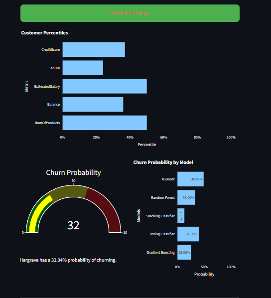

# Churn Sense

## Overview
Churn Sense is an interactive tool that utilizes multiple machine learning models to predict the likelihood of a bank customer churning. It offers a user-friendly interface built with Streamlit, featuring visualizations and a language model that generates explanations for the predictions and personalized retention emails.

Visit here: [Churn Sense](https://churn-sense.onrender.com)

## Preview

## Features
- **Multiple Model Predictions**: Leverage various machine learning models to assess customer churn risk.
- **Visualizations**: Interactive charts and graphs to visualize customer data and model predictions.
- **Explanation Generation**: Use a language model to provide insights into the prediction, helping users understand the factors influencing churn risk.
- **Personalized Emails**: Automatically generate tailored email templates to engage customers and encourage retention.

## Customer Data Requirements
To make a prediction, the web app requires the following customer data fields:

- **CreditScore**: (integer) The credit score of the customer.
- **Geography**: (string) The country of residence (e.g., "Spain").
- **Gender**: (string) The gender of the customer (e.g., "Male" or "Female").
- **Age**: (integer) The age of the customer.
- **Tenure**: (integer) The number of years the customer has been with the bank.
- **Balance**: (float) The current account balance of the customer.
- **NumOfProducts**: (integer) The number of products the customer has with the bank.
- **HasCrCard**: (integer) Indicates if the customer has a credit card (1 = Yes, 0 = No).
- **IsActiveMember**: (integer) Indicates if the customer is an active member (1 = Yes, 0 = No).
- **EstimatedSalary**: (float) The estimated salary of the customer.

## Available Models
The web app utilizes the following machine learning models for churn prediction:

- **XGBoost (xgb)**
- **Random Forest (rf)**
- **Selective Gradient Boosting (gb-selective)**
- **Voting Ensemble (voting)**
- **Stacking Ensemble (stacking)**
